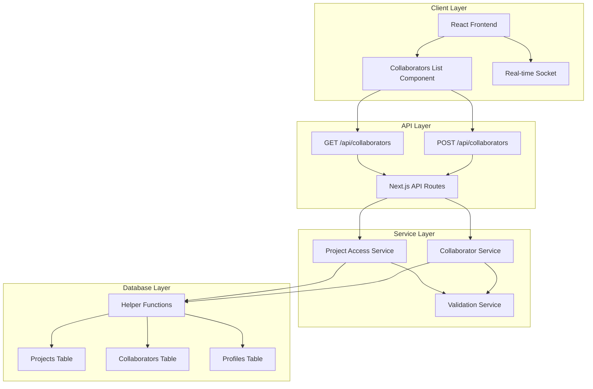

# Collaborator Visibility System - Complete Design Summary

## Overview

This document provides a comprehensive summary of the new collaborator visibility system designed to eliminate infinite recursion while enabling proper team collaboration.

## Architecture Diagram



## Key Design Principles

### 1. Project-Centric Access Control
- **Single Source of Truth**: Projects table determines all access rights
- **No Circular References**: Never query collaborators table to validate access to collaborators
- **Hierarchical Permissions**: Owner > Admin > Collaborator

### 2. Non-Recursive Helper Functions
All helper functions query ONLY the projects table:
```sql
is_project_owner(project_id, user_id)      -- Checks ownership
is_project_admin(project_id, user_id)      -- Checks admin rights
has_project_access(project_id, user_id)    -- Checks owner/admin access
can_manage_collaborators(project_id, user_id) -- Checks management rights
```

### 3. Clear Separation of Concerns
- **Visibility**: Who can see collaborators
- **Actions**: Who can modify collaborators
- **Access**: Who can access the project

## Visibility Rules Matrix

| User Role | Can See Owner | Can See Admins | Can See Collaborators | Can Add | Can Edit | Can Remove |
|-----------|---------------|----------------|----------------------|---------|----------|------------|
| Owner     | ✅            | ✅             | ✅                   | ✅      | ✅       | ✅         |
| Admin     | ✅            | ✅             | ✅                   | ✅      | ✅       | ❌ (owner) |
| Editor    | ✅            | ✅             | ✅                   | ❌      | ❌       | ❌         |
| Viewer    | ✅            | ✅             | ✅                   | ❌      | ❌       | ❌         |

## Database Schema

### Projects Table
```sql
CREATE TABLE projects (
  id UUID PRIMARY KEY,
  name TEXT NOT NULL,
  user_id UUID NOT NULL,           -- Project Owner
  admin_ids UUID[] DEFAULT '{}',   -- Array of Admin IDs
  created_at TIMESTAMP,
  updated_at TIMESTAMP
);
```

### Collaborators Table
```sql
CREATE TABLE collaborators (
  project_id UUID NOT NULL,
  user_id UUID NOT NULL,
  role TEXT NOT NULL,              -- admin, editor, viewer
  created_at TIMESTAMP,
  PRIMARY KEY (project_id, user_id)
);
```

## RLS Policy Structure

### Projects Table Policies
1. **Full Access**: Owners and admins have full CRUD access
2. **Read Access**: Collaborators can read project details
3. **Public Read** (optional): Authenticated users can read projects

### Collaborators Table Policies
1. **Full Access**: Owners have full CRUD access
2. **Manage Access**: Admins can view, add, update, remove collaborators
3. **View Access**: All project participants can see all collaborators
4. **Insert Prevention**: Cannot add project owner as collaborator

## API Endpoints

### GET /api/collaborators?projectId={uuid}
**Purpose**: Retrieve all collaborators for a project

**Logic**:
1. Verify user authentication
2. Check if user has ANY project access (owner, admin, or collaborator)
3. Return ALL collaborators for the project (not filtered by user role)

**Response**:
```json
{
  "collaborators": [...],
  "userRole": "owner|admin|editor|viewer",
  "canAddCollaborators": true,
  "projectInfo": {...}
}
```

### POST /api/collaborators
**Purpose**: Add new collaborator
**Requirements**: Owner or admin access
**Validation**: Prevent adding owner as collaborator

### PATCH /api/collaborators
**Purpose**: Update collaborator role
**Requirements**: Owner or admin access
**Validation**: Cannot modify owner's role

### DELETE /api/collaborators
**Purpose**: Remove collaborator
**Requirements**: Owner or admin access
**Validation**: Cannot remove project owner

## Security Features

### 1. Authentication
- All endpoints require valid authentication
- JWT token validation via Supabase Auth

### 2. Authorization
- Multi-layer permission checks (API, service, database)
- Role-based access control
- Principle of least privilege

### 3. SQL Injection Prevention
- Parameterized queries
- Supabase RPC functions for complex operations
- Input validation and sanitization

### 4. Audit Logging
- Track all collaborator management actions
- Log who performed what action and when
- Store metadata for compliance

## Performance Optimizations

### 1. Database Indexes
- Primary key indexes on (project_id, user_id)
- Index on projects.user_id for owner lookups
- GIN index on projects.admin_ids for admin lookups

### 2. Query Optimization
- Simple EXISTS queries instead of complex JOINs
- Efficient helper functions marked as STABLE
- Avoid recursive policy checks

### 3. Caching Strategy
- Cache project metadata for frequently accessed projects
- Cache user permissions for short periods
- Implement application-level caching

## Error Handling

### Error Types
- **401 Unauthorized**: User not authenticated
- **403 Forbidden**: User lacks required permissions
- **404 Not Found**: Resource not found
- **409 Conflict**: Resource already exists
- **500 Internal Server Error**: Unexpected failures

### Error Recovery
- Graceful degradation for non-critical errors
- Detailed error messages for debugging
- Retry mechanisms for transient failures

## Testing Strategy

### Unit Tests
- Test all helper functions with various inputs
- Test permission checks with different user roles
- Test edge cases and error conditions

### Integration Tests
- Test complete collaborator workflows
- Test RLS policies with different user contexts
- Test API endpoints with authentication

### Performance Tests
- Test query performance with large datasets
- Test concurrent access patterns
- Test memory usage and caching

## Migration Strategy

### 1. Pre-Migration
- Backup existing data
- Document current RLS policies
- Identify affected users

### 2. Migration Steps
1. Disable RLS temporarily
2. Remove existing problematic policies
3. Create new helper functions
4. Implement new RLS policies
5. Re-enable RLS
6. Verify functionality

### 3. Post-Migration
- Test all user roles
- Monitor for performance issues
- Validate all features work correctly

## Monitoring and Maintenance

### 1. Monitoring
- Track RLS policy violations
- Monitor permission denial patterns
- Watch for recursion attempts
- Monitor query performance

### 2. Maintenance
- Regular security audits
- Performance optimization reviews
- User access pattern analysis
- Policy updates as needed

## Implementation Files

### Core Files Created:
1. **`C:\dev\codejoin-new\scripts\implement-recursion-safe-collaborator-system.sql`**
   - Complete database implementation
   - Helper functions and RLS policies
   - Verification and testing queries

2. **`C:\dev\codejoin-new\app\api\collaborators\route-v2.ts`**
   - Updated API endpoints using new architecture
   - Non-recursive permission checking
   - Comprehensive error handling

3. **`C:\dev\codejoin-new\docs\collaborator-visibility-api-design.md`**
   - Detailed API specification
   - Security considerations
   - Performance guidelines

4. **`C:\dev\codejoin-new\docs\recursion-safe-backend-architecture.md`**
   - Complete backend architecture design
   - Security implementation details
   - Performance optimization strategies

## Benefits of This Design

### 1. Eliminates Infinite Recursion
- No circular dependencies between tables
- Clear, non-recursive policy structure
- Predictable query behavior

### 2. Improves Performance
- Simple, efficient queries
- Reduced database load
- Better caching opportunities

### 3. Enhances Security
- Clear permission boundaries
- Comprehensive access control
- Audit trail for all actions

### 4. Simplifies Maintenance
- Clear separation of concerns
- Well-documented policies
- Easy to understand and modify

### 5. Scales Efficiently
- No recursive policy overhead
- Optimized database queries
- Horizontal scaling ready

This design provides a robust, secure, and performant foundation for collaborator visibility while completely eliminating the risk of infinite recursion that plagued the previous implementation.